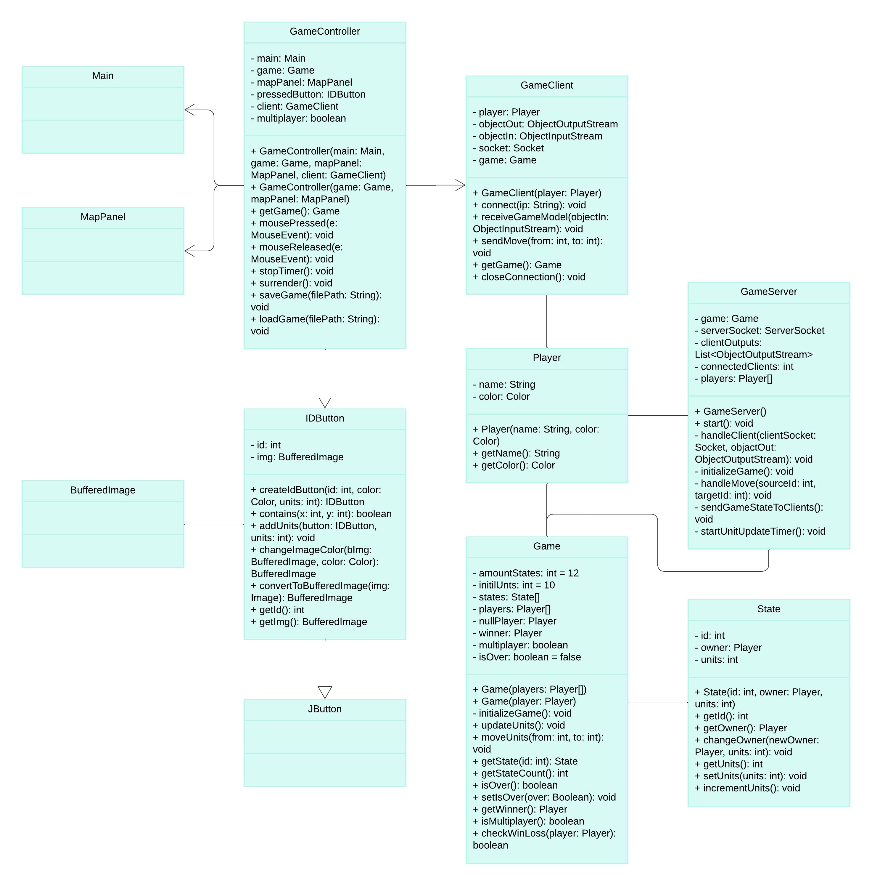

# ConquerTheWorld

## Spielbeschreibung

Willkommen zu unserem Spiel! In diesem Spiel übernehmen ein bis zwei Spieler die Kontrolle über verschiedene Staaten und versuchen, die Kontrolle über alle Staaten zu übernehmen, indem sie Einheiten bewegen und gegnerische Staaten angreifen.

## Inhaltsverzeichnis

- [Features](#features)
- [Installation](#installation)
- [Spielprinzip](#spielprinzip)
- [Spielanleitung](#spielanleitung)
- [Klassenübersicht](#klassenübersicht)
- [Ordnerstruktur](#ordnerstruktur)
- [Mitwirkende](#mitwirkende)

## Features

- **Resizing**: Nach dem Starten des Spiels kann die Fenstergröße nach belieben geändert werden, die größe der Karte passt sich automatisch an um immer volle Übersicht zu gewährleisten.
- **Multiplayer**: Spiele in diesem Modus gegen andere um dein Können zu zeigen
- **Singleplayer**: Um besser zu werden, kann eine Solo Runde gestartet werden, hier kann das Spielprinzip verstanden und eine Taktik zum Gewinnen im Multiplayer entwickelt werden.
- **Spiel speichern**: Um eine angefangene Solo Runde später zu beenden kann das Spiel gespeichert und später geladen werden.


## Installation

1. **Repository klonen**:
    ```bash
    git clone https://github.com/tomtls/ConquerTheWorld.git
    cd ConquerTheWorld
    ```

2. **Spiel kompilieren**:
    Stelle sicher, dass JDK installiert ist. Kompiliere dann das Spiel mit folgendem Befehl:
    ```bash
    javac -d bin src/*.java
    ```

3. **Spiel starten**:
    ```bash
    java -cp bin Main
    ```

## Spielprinzip

- Jeder Spieler beginnt mit einer festgelegten Anzahl von Einheiten in seinen Startstaat.
- Spieler können Einheiten von einem Staat in einen anderen Staat bewegen.
- Wenn ein Spieler Einheiten in einen gegnerischen Staat bewegt, kämpfen die Einheiten. Der Staat wechselt den Besitzer, wenn die angreifenden Einheiten die verteidigenden Einheiten besiegen.
- Das Spiel endet, wenn ein Spieler alle Staaten kontrolliert.


## Spielanleitung

**Startmenü**

Nach dem Starten der main-Methode, steht dem Spieler ein Text zu Verfügung um einen Namen einzugeben, daneben kann die gewünschte Farbe ausgewählt werden. Um zu spielen gibt es 3 Möglichkeiten:
- "Start Game" für eine Solo Runde
- "Multiplayer" um ein Gegenspieler zu haben
- "Load game" zum öffnen einer gespeicherten Solo Runde  


**Steuerung**

Um einen anderen Staat anzugreifen, muss zunächst ein eigener Staat mit der linken Maustaste geklickt, gedrückt gehalten und anschließend über dem anzugreifenden Staat losgelassen werden.


**Multiplayer**

Zur Zeit wird das Spiel Lokal gehostest. Nachdem im Startmenü der Multiplayer ausgewählt wurde, muss zunächst der Server gestartet werden ("Start Server"), dadurch wird zusätzlich ein client gestartet, der 2. Spieler clickt zunächst "Connect to Server", dadurch wird die Möglichkeit gegeben eine andere IP als 127.0.0.1 (localhost) zu nutzen und verbindet sich anschließend mit dem Server nach clicken auf "Connect". Nun startet das Spiel.


**Speichern und laden**

In einer Solo Runde befindet sich unten ein Button zum speichern und beenden. Das Spiel wird lokal im Projektverzeichnis gespeichert und kann nun jederzeit gestartet werde.
VORSICHT: Speichern überschreibt die Datei und somit öffnet sich das zuletzt gespeicherte Spiel


## Klassenübersicht

### View

#### `Main`
- Start des Spiels, verwaltet das Hauptfenster und die Anzeige

#### `MapPanel`
- Panel zum angeigen der Spielkarte 

#### `PreGamePanel`
- Startanzeige für Eingabe von Spielernamen und Farbe, sowie die Art des Spielmodus

#### `MultiplayerSetupPanel`
- Lässt den Spieler auswählen ob ein Server gestartet wird oder ein Client

#### `ServerWaitingPanel`
- Wartescreen um auf ein 2. Client zu warten, zeigt die IP zum verbinden an.

#### `ClientConnectingPanel`
- Eingabe der IP vom Server um Client zu starten, default IP ist localhost 

#### `WinnerPanel`
- Anzeige des Gewinners in seine Spielerfarbe

### Model

#### `Game`
- Verwaltet den Spielstatus, die Spieler und die Staaten.
- Enthält Methoden zum Aktualisieren der Einheiten, Bewegen der Einheiten und Überprüfen des Spielendes.

#### `Player`
- Repräsentiert einen Spieler im Spiel mit einem Namen und einer Farbe.

#### `State`
- Repräsentiert einen Staat im Spiel, einschließlich der Einheitenanzahl und dem Besitzer.

#### `IDButton`
- Ein JButton mit einer ID, der für die Darstellung eines Staates verwendet wird.
- Enthält Methoden zum Ändern der Farbe des Buttons und zur Aktualisierung der Einheitenanzahl.

### Controller

#### `GameController`
- Handhabt die Interaktionen der Spieler mit dem Spiel.
- Verwaltet die Aktualisierung der Einheiten, das Bewegen der Einheiten und die Kommunikation mit dem Server im Multiplayer-Modus.

### Network

#### `GameClient`
- Verbindet sich mit dem Spielserver und kommuniziert mit diesem, um Spielzüge zu senden und den Spielstatus zu empfangen.

#### `GameServer`
- Verwaltet die Verbindung mit den Clients und synchronisiert den Spielstatus zwischen ihnen.
- Aktualisiert regelmäßig die Einheiten in den Staaten und sendet den aktuellen Spielstatus an die Clients.

## UML


## Ordnerstruktur
Hier ist die vollständige Ordnerstruktur des Projekts:

```
src
├── network
│   ├── GameClient.java
│   └── GameServer.java
├── controller
│   └── Controller.java
├── model
│   ├── Game.java
│   ├── IDButton.java
│   ├── Player.java
│   ├── State.java
│   └── Unit.java
├── imgNumber
│   ├── 0.png
│   ├── 1.png
│   ├── 2.png
│   ├── 3.png
│   ├── 4.png
│   ├── 5.png
│   ├── 6.png
│   ├── 7.png
│   ├── 8.png
│   ├── 9.png
│   ├── 10.png
│   └── 11.png
└── view
    ├── ClientConnectingPanel.java
    ├── Main.java
    ├── MapPanel.java
    ├── MultiplayerSetupPanel.java
    ├── PreGamePanel.java
    ├── ServerWaitingPanel.java
    └── WinnerPanel.java
```


## Mitwirkende
- **Tom Schneider**
- **Malte Beissel**
- **Kjell Wolff**
